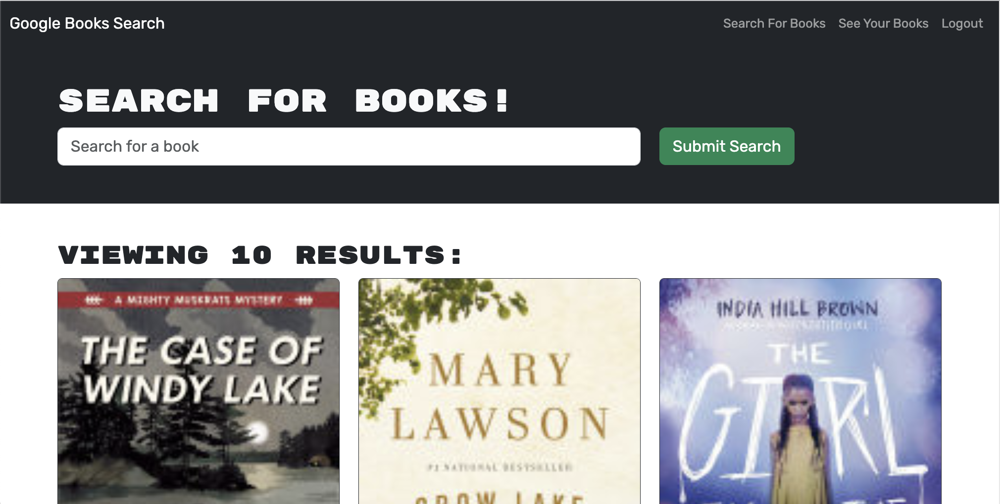
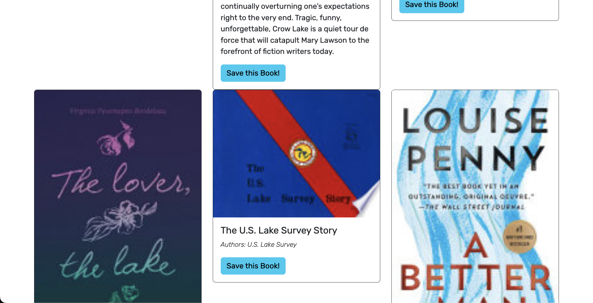
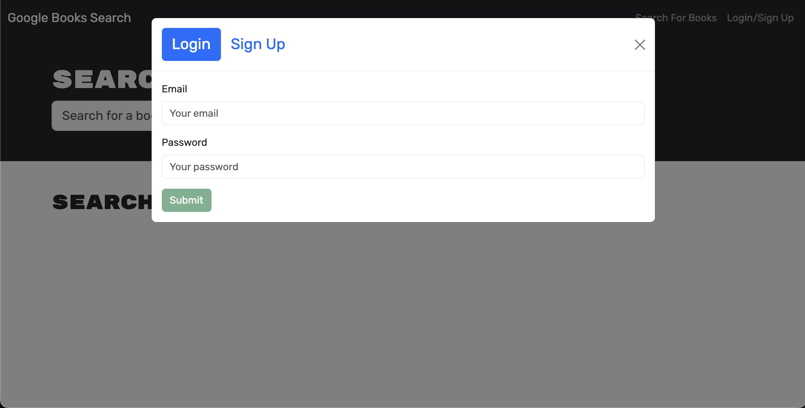
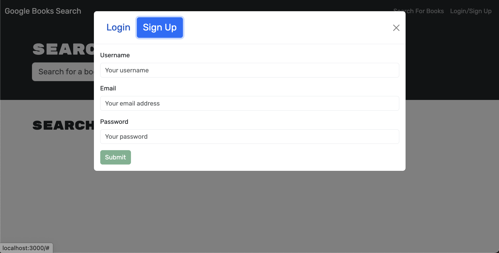
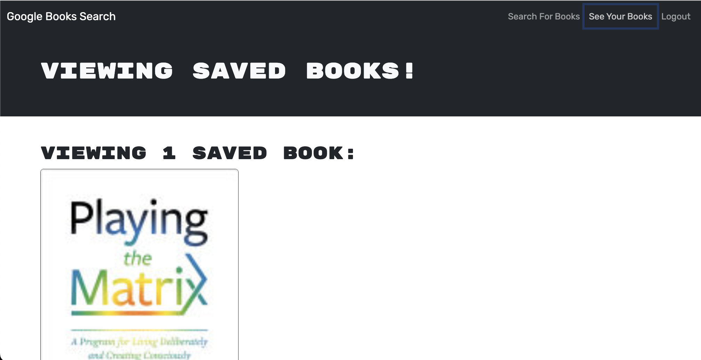
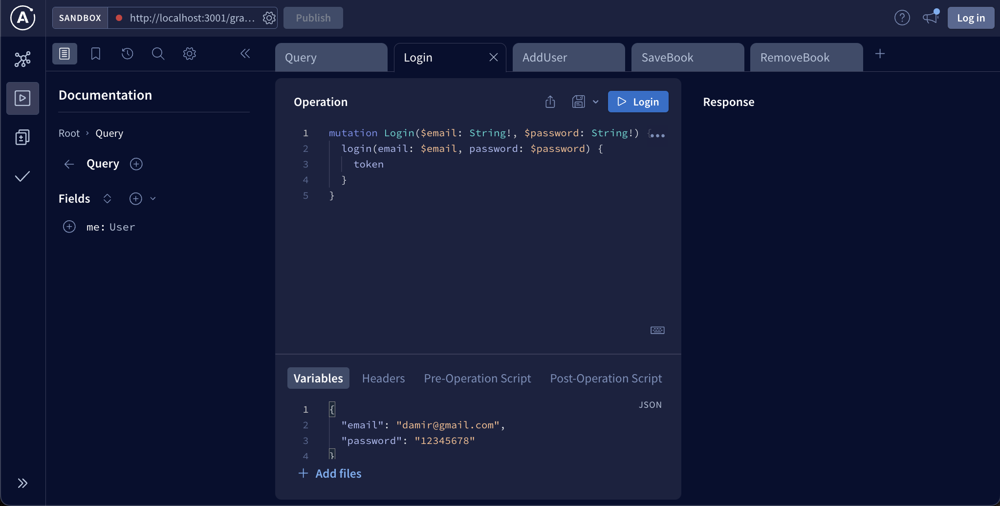
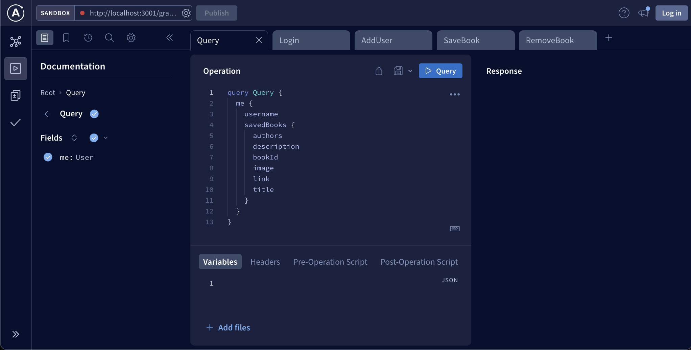
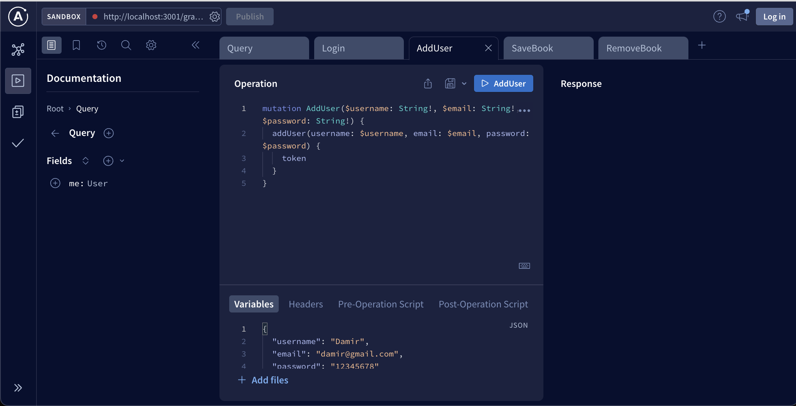
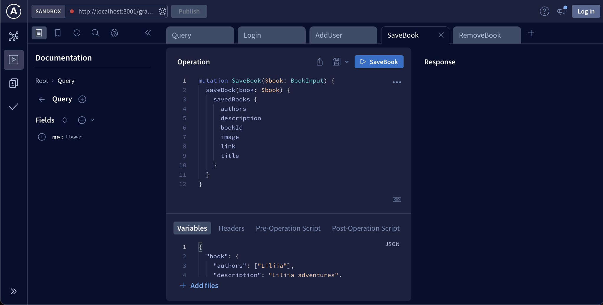
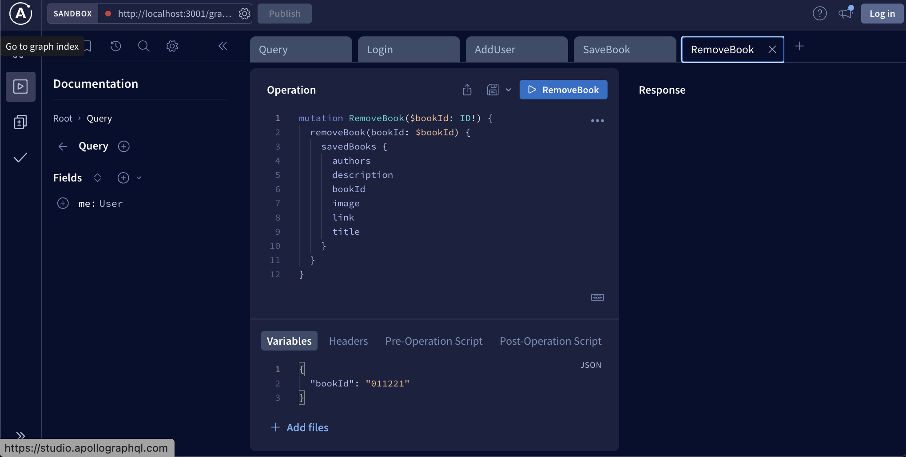

# Bookshelf [MERN]

## Description

The Bookshelf App is a full-stack web application that allows users to search for books using the Google Books API, save them to their personal bookshelf, and view and manage their saved books.

## Content  

- [Screenshots](#Screenshots)
- [Technologies](#Technologies)
- [Link-of-deployed-application](#Link-of-deployed-application)
- [Features](#Features)
- [Installation](#Installation)
- [Contributing](#Contributing)
- [Questions](#Questions)

## Screenshots

- User can type a search term (in this case, "star wars") in a search box and the results appear:

- User can save books by clicking "Save This Book!" under each search result:

- User can view their saved books on a separate page:

- Managing queries from Apollo Server 

## Technologies

1. Frontend:
- React.js
- Apollo Client for GraphQL

2. Backend:
- Node.js
- Express.js
- Apollo Server for GraphQL
- MongoDB with Mongoose for data storage

## Link of deployed application

- 

## Features

1. User Authentication:
- Users can sign up and log in to the application.
- JWT (JSON Web Tokens) are used for secure user authentication.
2. Search Books:
- Users can search for books using the Google Books API.
- Search results display book information, including title, authors, description, and cover image.
3. Save Books:
- Authenticated users can save books to their personal bookshelf.
- Saved books are stored in the MongoDB database.
4. View and Manage Saved Books:
- Users can view a list of their saved books on the Bookshelf page.
- Each saved book displays details such as title, authors, description, and cover image.
- Users can delete a book from their bookshelf.

## Installation

Follow these steps to set up the Candy Comment App on your local machine:

1. Clone the repository;
2. Install dependencies;
3. Set up your database.

## Contributing

Contributions are welcome!

## Questions
If you have any questions or issues, please feel free to reach out:
- GitHub: https://github.com/DamirFM
